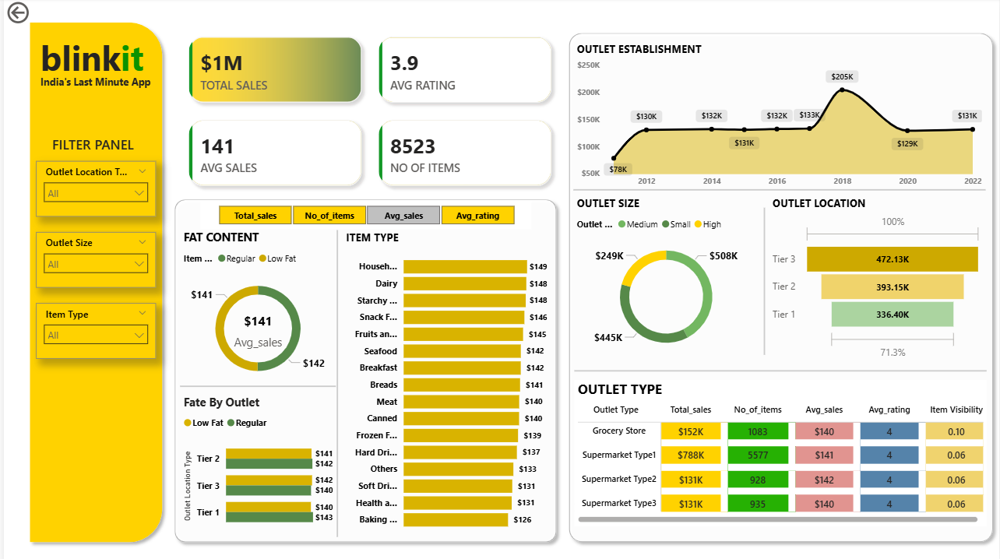

# 📊 Power BI Sales Analysis Dashboard

## 📸 Dashboard Screenshots

## 📌 Project Overview
This Power BI project analyzes sales performance to identify trends, top products,
and revenue insights using interactive dashboards.

## 🧰 Tools & Technologies
- Power BI
- Excel / CSV
- DAX
- Data Cleaning & Modeling

## 📂 Dataset
- Source: Sample sales dataset
- Format: CSV
- Records: 50,000+

## 📈 Dashboard Features
- Total Sales & Revenue
- Monthly & Yearly Trends
- Top Products & Categories
- Region-wise Performance
- Interactive Filters & Slicers

## 🔍 Key Insights
- Electronics category generated highest revenue
- Q4 has peak sales every year
- North region outperforms others

## ▶️ How to Use
1. Download the `.pbix` file
2. Open using Power BI Desktop
3. Refresh data if required

## 🚀 Future Enhancements
- Add forecasting
- Include real-time data
- Advanced DAX measures

## 👤 Author
**Ajay Chitroda**  
Data Analyst | Data Scientist  
